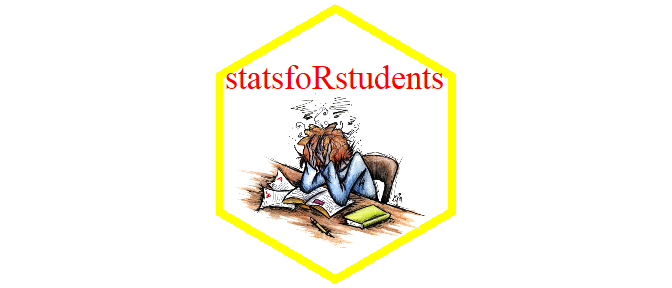

<link rel="stylesheet" href="styles.css" type="text/css">
<link rel="stylesheet" href="academicicons/css/academicicons.min.css"/>

## Projects

I summarize various projects I have worked on during my graduate coursework.

### A Random-Effects Markov Random Field Model for Cartridge Case Comparison Algorithms

Final project for STAT 615: Advanced Bayesian Methods.
I worked on this project by myself.
Find report, presentation slides, and code on [GitHub](https://github.com/jzemmels/stat615_project).
  
The goal of this project was to obtain a model-based estimate of a cartridge case comparison algorithm's error rate.
I developed a Bayesian random-effects model with a Markov Random Field spatial term to capture behavior in the similarity scores for two cartridge cases computed by the algorithm.
I fit the model using the Integrated Nested LaPlace Approximation (INLA) algorithm as implemented in the [`inla`](https://becarioprecario.bitbucket.io/inla-gitbook/index.html) R package.
I was able to obtain interpretable parameter estimates that measured, for example, whether the algorithm naturally assigns high similarity scores to specific cartridge cases or cartridge cases fired from specific barrels.
The spatial parameter estimates were also interpretable and indicated regions of a cartridge case that tend to be assigned higher similarity scores compared to other regions.

Tools utilized:

- [`inla`](https://becarioprecario.bitbucket.io/inla-gitbook/index.html): fit model to data

- [`xaringan`](https://cran.r-project.org/web/packages/xaringan/index.html): create presentation slides

- [`rmarkdown`](https://cran.r-project.org/web/packages/rmarkdown/index.html), [`knitr`](https://cran.r-project.org/web/packages/knitr/index.html): write report

- [`dplyr`](https://dplyr.tidyverse.org/), [`tidyr`](https://tidyr.tidyverse.org/), [`purrr`](https://purrr.tidyverse.org/), [`stringr`](https://stringr.tidyverse.org/): process model data

- [`ggplot2`](https://ggplot2.tidyverse.org/): create visualizations of model estimates and findings.

### BirdCLEF 2021 - Birdcall Identification

Final project for STAT 602: Modern Multivariate Statistical Learning.
I worked in a team of three on this project.
Report, presentation slides, and code can be found on [GitHub](https://github.com/jzemmels/stat602project).

The goal of this project was to classify whether a 5 second audio clip contained a bird call.
We converted an audio file to a 2D frequency over time representation called a *spectrogram* (see example above).
The three of us then independently engineered features for each spectrogram and trained our own classifiers using these features.
For example, I trained *k*-Nearest Neighbors, Random Forest, XGBoost, support-vector machine, and C5.0 classifiers.
Each of our classifiers returned a probability that an audio file contained a bird call.
We then trained a Classification and Regression Tree (CART) model using these class probabilities.
Our leave one out cross-validation estimated accuracy using the ensembling technique was 0.944 (i.e., we were able to correctly classify 94.4% of training audio files correctly).
Unfortunately, we ran out of time in the semester to apply our trained model to test data.

Tools utilized:

- [`caret`](https://topepo.github.io/caret/): R API to various machine learning algorithms

- [`signal`](https://cran.r-project.org/web/packages/signal/index.html), [`imager`](https://cran.r-project.org/web/packages/imager/index.html): low-level signal and image processing tools

- [`dplyr`](https://dplyr.tidyverse.org/), [`tidyr`](https://tidyr.tidyverse.org/), [`purrr`](https://purrr.tidyverse.org/), [`stringr`](https://stringr.tidyverse.org/): process image data and similarity features

- [`ggplot2`](https://ggplot2.tidyverse.org/): create summary visualizations of findings.

- [`xaringan`](https://cran.r-project.org/web/packages/xaringan/index.html): create presentation slides

### Hidden Markov Random Field Models for Image Texture Segmentation

Final project for STAT 590B: Missing Data Methods.
I worked on this project by myself.
Code and presentation slides can be found on [GitHub](https://github.com/jzemmels/STAT590_finalPresentation).

The goal of this project was to use an algorithm to classify regions of an images with different textures using a Hidden Markov Random Field (HMRF) model.
This model models an individual pixel's texture classification as a latent variable that depends on the texture classifications of neighboring pixels.
I use a Markov Random Field model to describe the spatial relationship between pixel classifications.
The picture above shows an example of (top row) simulated images of various textures with added noise and (bottom row) the texture classifications using the HMRF model.
The first two images are the same except for the standard deviation of the added noise.
The misclassification rate (MCR) is used as a diagnostic - results indicate that MCR is more heavily affected by noise than the number of classes.

Tools utilized:

- [`skimage`](https://scikit-image.org/): I used the scikit-image Python library to perform a variety of image processing tasks.

- [`sklearn`](https://scikit-learn.org/stable/): I used the scikit-learn Python library's `k-means` function as a benchmark to which the HMRF was compared.

- [`reticulate`](https://rstudio.github.io/reticulate/): use Python functions in R

- [`xaringan`](https://cran.r-project.org/web/packages/xaringan/index.html): create presentation slides

- [`mrf2d`](https://cran.r-project.org/web/packages/mrf2d/index.html): R implementation of the Hidden Markov Random Field model

### Bayesian Analysis of the Chemical Composition of Float Glass

Final project for STAT 544: Bayesian Statistics.
I worked on this project by myself.
Report, slides, and code can be found on [GitHub](https://github.com/jzemmels/bayesianFloatGlassAnalysis).

The goal of this project was to model the chemical concentrations of float glass.
Forensic glass analysts use these chemical concentrations to, for example, match glass shards found on a suspect to a broken window at a crime scene.
Modeling this chemical concentration helps us understand how these chemical concentrations vary across manufacturers, time, and individual panes of glass.
Panes of glass were obtained from two float glass manufacturers and the concentration of various elements (e.g., Iron, Hafnium, Zirconium) were measured per pane.
During exploratory data analysis, I identified change in the concentration of some elements over time.
Thus, I compared two Bayesian models: one that modeled the chemical concentration per pane of glass (i.e., independence between sampled panes) and another that modeled a dependence over time as stationary autoregressive.
After model fitting and diagnosing, I noticed an extreme positive dependence between mean concentrations over time for Hafnium and Zirconium.
It seems that the raw materials used in the manufacturing of these panes started off with large concentrations of these elements that "ran out" over time.

Tools utilized:

- [`rstan`](https://mc-stan.org/users/interfaces/rstan), [`bayesplot`](https://mc-stan.org/bayesplot/): fit and diagnose the Bayesian models

- [`xaringan`](https://cran.r-project.org/web/packages/xaringan/index.html): create presentation slides

- [`rmarkdown`](https://cran.r-project.org/web/packages/rmarkdown/index.html), [`knitr`](https://cran.r-project.org/web/packages/knitr/index.html): write report

- [`dplyr`](https://dplyr.tidyverse.org/), [`tidyr`](https://tidyr.tidyverse.org/), [`purrr`](https://purrr.tidyverse.org/), [`stringr`](https://stringr.tidyverse.org/), [`lubridate`](https://lubridate.tidyverse.org/): process glass and model data

- [`ggplot2`](https://ggplot2.tidyverse.org/): create visualizations of model estimates and findings.
  
### statsfoRstudents package and shiny application

Final project for STAT 585: Data Technologies for Statistical Analysis.
I worked on this project in a team of four.
Code for my contribution to the project can be found on [GitHub](https://github.com/jzemmels/statsfoRstudents).

The goal of this project was to create a package and interactive web application to help statistics students learn introductory concepts.
I created a visual tool for determining when to accept or reject a hypothesis test given null and alternative hypotheses, a test statistic, and a significance level.
I also added a madlibs-style Hypothesis Test "game" whereby a students are given a random hypothesis test-related problem and must fill-in blanks in the standard hypothesis testing procedure.
Finally, I created a visual tool to demonstrate the asymptotic distributional properties of the sample mean.

- [`devtools`](https://cran.r-project.org/web/packages/devtools/index.html), [`testthat`](https://testthat.r-lib.org/), [`usethis`](https://usethis.r-lib.org/), [`pkgdown`](https://pkgdown.r-lib.org/): tools to create and maintain package and write unit tests

- [`dplyr`](https://dplyr.tidyverse.org/), [`tidyr`](https://tidyr.tidyverse.org/), [`purrr`](https://purrr.tidyverse.org/), [`stringr`](https://stringr.tidyverse.org/): process simulated data before visualizing.

- [`ggplot2`](https://ggplot2.tidyverse.org/): create educational visualizations

- [`shiny`](https://shiny.rstudio.com/): app UI and backend

## Coursework

**Cumulative Graduate GPA:** 3.95

**Fall 2021**

  - STAT 615: Advanced Bayesian Methods by Dr. Jarad Niemi, Grade: A
  
**Spring 2021**

  - STAT 602: Modern Multivariate Statistical Learning by Dr. Stephen Vardeman, Grade: A
  
**Fall 2020**

  - EE 524: Digital Signal Processing by Dr. Aleksandar Dogandzic, Grade: A

  - STAT 590B: Missing Data Methods by Dr. Jae-Kwang Kim, Grade: A

  - STAT 643: Advanced Theory of Statistical Inference by Dr. Daniel Nordman, Grade: A
  
**Spring 2020**

  - STAT 544: Bayesian Statistics by Dr. Danica Ommen, Grade: A
  
  - STAT 601: Advanced Statistical Methods by Dr. Mark Kaiser, Grade: A-
  
  - STAT 642: Advanced Probability Theory by Dr. Vivekananda Roy, Grade: A-
  
**Fall 2019**
  
  - STAT 520: Statistical Methods III by Dr. Emily Berg, Grade: A
  
  - STAT 551: Time Series Analysis by Dr. Daniel Nordman, Grade: A

  - STAT 641: Foundations of Probability Theory by Dr. Arka Ghosh, Grade: A-
  
**Spring 2019**

  - COM S: Introduction to Machine Learning by Dr. Kris De Brabanter, Grade: A
  
  - STAT 510: Statistical Methods II by Dr. Daniel Nettleton, Grade: A
  
  - STAT 543: Theory of Probability and Statistics II by Dr. Vivekananda Roy, Grade: A
  
  - STAT 585: Data Technologies for Statistical Analysis by Dr. Heike Hofmann, Grade: A
  
**Fall 2018**

  - STAT 500: Statistical Methods I by Dr. Peng Liu, Grade: A
  
  - STAT 542: Theory of Probability and Statistics I by Dr. Lily Wang, Grade: A
  
  - STAT 579: An Introduction to R by Dr. Heike Hofmann, Grade: A
