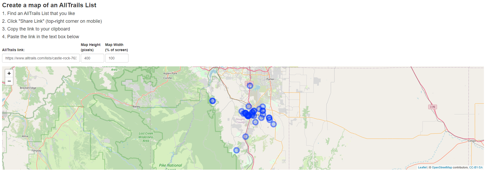
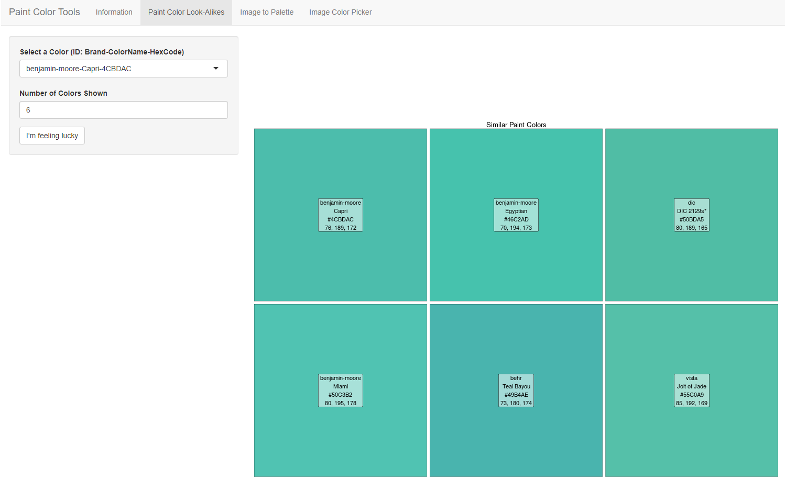
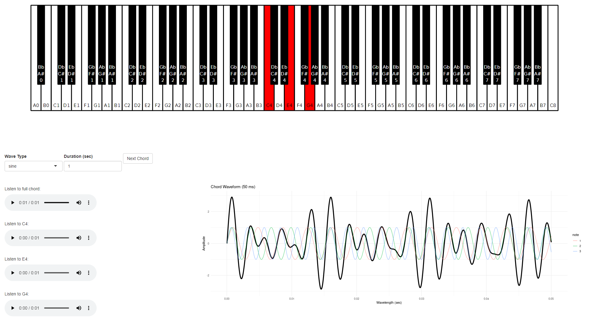
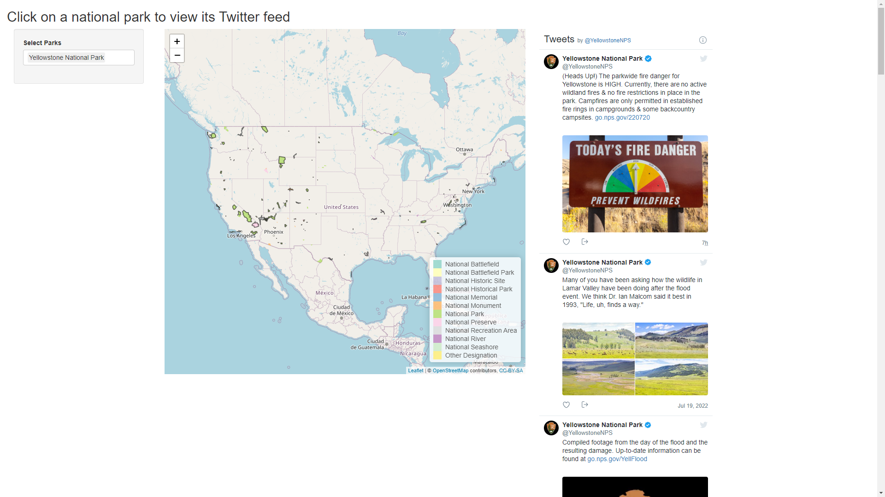
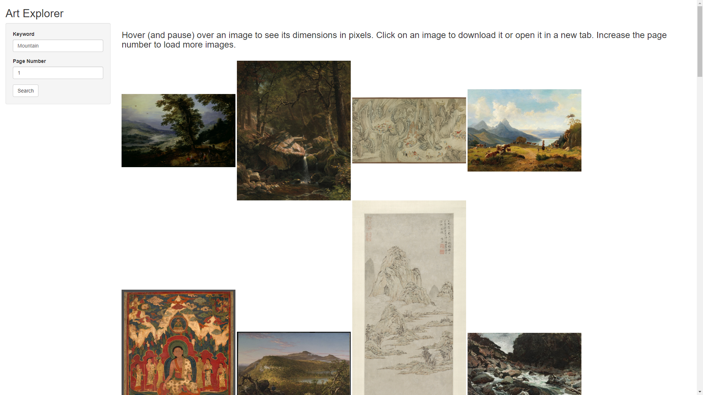
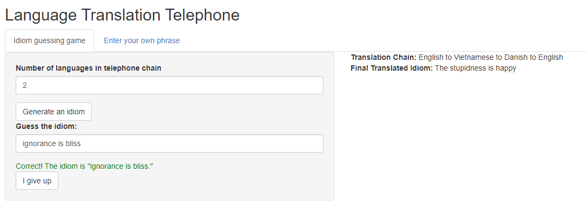
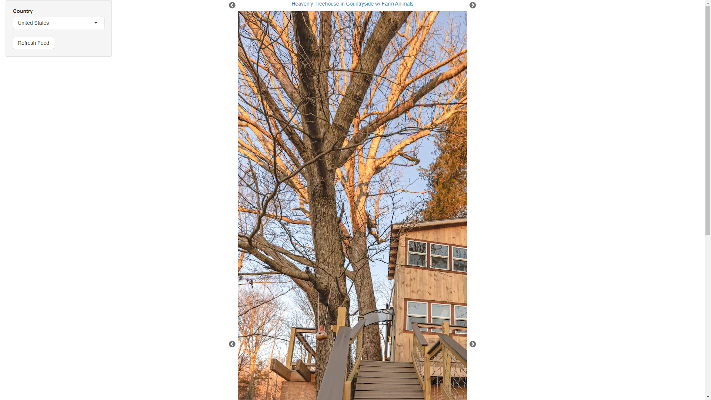

<link rel="stylesheet" href="styles.css" type="text/css">
<link rel="stylesheet" href="academicicons/css/academicicons.min.css"/>

## Shiny Applications

I like to make silly and occasionally useful interactive applications using the [`shiny`](https://shiny.rstudio.com/) R package.

### RllTrails

Access the RllTrails app at [https://jzemmels.shinyapps.io/RllTrails/](https://jzemmels.shinyapps.io/RllTrails/). The source code is available on [GitHub](https://github.com/jzemmels/RllTrails).

Visualize custom AllTrails lists.
I'm not a fan of the AllTrails map UI and its impossible to visualize a user-created list on a map in the Android version of AllTrails.
Paste a link to a user-created list of trails to visualize it on a map.

Tools utilized:

- [`rvest`](https://rvest.tidyverse.org/): scrape geographic and metadata from an AllTrails user-created list

- [`jsonlite`](https://cran.r-project.org/web/packages/jsonlite/index.html): convert raw JSON file to an R data frame

- [`leaflet`](https://rstudio.github.io/leaflet/): visualize trails on an OpenStreetMap

- [`dplyr`](https://dplyr.tidyverse.org/), [`tidyr`](https://tidyr.tidyverse.org/), [`purrr`](https://purrr.tidyverse.org/), [`stringr`](https://stringr.tidyverse.org/): tidy the data for visualization

- [`shiny`](https://shiny.rstudio.com/): app UI and backend

To-do:

- Currently the app shows individual points for each trail. Upon clicking a specific trail, I would like to show the trail's path as it appears on AllTrails.

- Aesthetic changes (it's currently default shiny)

### paintColorTools

Access the paintColorTools app at [jzemmels.shinyapps.io/paintcolortools/](jzemmels.shinyapps.io/paintcolortools/).
The source code is available on [GitHub](https://github.com/jzemmels/paintColorTools).

Explore and compare paint colors from a variety of brands.
We moved into a new townhouse that was in desperate need of new paint colors.
As we started researching various brands, I realized that they all use obscure names and proprietary coding schemes to uniquely identify their colors.
Whether intended or not, this made it extremely difficult to directly compare colors across brands.
Using data from [Converting Colors](https://convertingcolors.com/lists.html), I designed this app to easily compare similar paint colors across brands (measured by Euclidean distance in RGB space).
Additionally, I added functionality to calculate a palette of representative colors or select colors by individual pixels from an uploaded image.

Tools utilized:

- [`magick`](https://cran.r-project.org/web/packages/magick/index.html), [`imager`](https://cran.r-project.org/web/packages/imager/index.html): low-level image processing tools

- [`ggplot2`](https://ggplot2.tidyverse.org/): visualize paint colors, uploaded image, and color palette

- [`dbscan`](https://cran.r-project.org/web/packages/dbscan/index.html): calculate representative colors in RGB space by identifying cluster medioids from the Density-Based Spatial Clustering of Applications with Noise (DBSCAN) algorithm

- [`dplyr`](https://dplyr.tidyverse.org/), [`tidyr`](https://tidyr.tidyverse.org/), [`purrr`](https://purrr.tidyverse.org/), [`stringr`](https://stringr.tidyverse.org/): manipulate the data for comparison and visualization

- [`shiny`](https://shiny.rstudio.com/): app UI and backend

To-do:

- The way I've applied the DBSCAN algorithm appears to be max-ing out the 1 Gb of internal memory allowed on shinyapps.io - I need to either figure out how to reduce the memory usage or use a simpler algorithm such as k-means.

- Aesthetic changes (it's currently default shiny)

### musicFrequencyExplorer

Access the musicFrequencyExplorer app at [https://jzemmels.shinyapps.io/musicFrequencyExplorer/](https://jzemmels.shinyapps.io/musicFrequencyExplorer/). The source code is available on [GitHub](https://github.com/jzemmels/musicFrequencyExplorer).

Play notes and chords on a synthetic piano. As a consumer of synthwave music, I was interested in learning more about how to build chords and chord progressions on a piano.
I discovered the `tuneR` package that can create, read, and write pure waveforms of an arbitrary frequency.
I created this app to explore notes on the western chromatic scale, build chords, and even (slowly) create songs.
I am particularly proud of the piano UI that I created using the `ggiraph` package.

Tools utilized:

- [`tuneR`](https://cran.r-project.org/web/packages/tuneR/index.html), [`signal`](https://cran.r-project.org/web/packages/signal/index.html): generate, manipulate, read, and write waveforms

- [`ggiraph`](https://davidgohel.github.io/ggiraph/): creates interactive ggplots. I created a piano interface where clicking on a note simulates the pressing of the associated piano key.

- [`rvest`](https://rvest.tidyverse.org/): scrape note frequency data from [https://pages.mtu.edu/~suits/notefreqs.html](https://pages.mtu.edu/~suits/notefreqs.html) 

- [`dplyr`](https://dplyr.tidyverse.org/), [`tidyr`](https://tidyr.tidyverse.org/), [`purrr`](https://purrr.tidyverse.org/), [`stringr`](https://stringr.tidyverse.org/): manipulate note frequency data to generate notes/chords

- [`shiny`](https://shiny.rstudio.com/): app UI and backend

To-do:

- Identify/suggest notes and chord progressions based on user input

- Aesthetic changes (it's currently default shiny)

### nationalParkTwitter

Access the nationalParkTwitter app at [https://jzemmels.shinyapps.io/nationalParkTwitter/](https://jzemmels.shinyapps.io/nationalParkTwitter/).
The source code is available on [GitHub](https://github.com/jzemmels/nationalParkTwitter).

I had recently joined Twitter and was interested in learning about the various U.S. national parks, monuments, preserves, etc.
It turns out that most of these locations have their own devoted Twitter feed.
The user can click on a national park shown on the map to view its Twitter feed.
I have used the app to learn more about the spatial relationship between national parks and will certainly use it in the future if planning a trip to get park updates.

Tools utilized:

- [U.S. National Park Service .shp files](https://irma.nps.gov/DataStore/DownloadFile/673366): contains geographic data on U.S. national parks including park boundary geometries

- [`sf`](https://cran.r-project.org/web/packages/sf/index.html): read the .shp files into an sf data frame, transform between coordinate systems, and simplify NPS park boundary geometries (to reduce memory load)

- [`leaflet`](https://rstudio.github.io/leaflet/): plot the park boundaries on an interactive OpenStreetMap

- [`rvest`](https://rvest.tidyverse.org/): scrape NPS twitter from [this website](https://jasoncochran.com/blog/all-the-national-park-service-twitter-accounts-in-one-place/)

- [`rtweet`](https://cran.r-project.org/web/packages/rtweet/index.html): scrape followers/friends of the National Park Service's primary twitter account to get more NPS twitter handles

- [`dplyr`](https://dplyr.tidyverse.org/), [`tidyr`](https://tidyr.tidyverse.org/), [`purrr`](https://purrr.tidyverse.org/), [`stringr`](https://stringr.tidyverse.org/): manipulate and join NPS twitter data to geographic data

- [`shiny`](https://shiny.rstudio.com/): app UI and backend

To-do:

- Add national parks from other countries (e.g., Canada's park system has a similar Twitter presence)

- Track down missing NPS twitter handles

- Aesthetic changes (it's currently default shiny)

### artExplorer

The source code is available on [GitHub](https://github.com/jzemmels/artExplorer). 
I haven't hosted this app on shinyapps.io because I am limited to five applications under a free account.
You can still clone this repo and run the app locally.

Explore and download high-quality, public domain images of art.
Did you know that you can download high-quality images of famous artworks from institutions like the [Art Institute of Chicago](https://www.artic.edu/open-access/public-api)?
Many of these images are in the public domain, meaning you can print these images on a poster or canvas and only pay for the cost of printing.
Having recently moved into a new townhouse, we had a lot of wall space to cover and not a ton of funds to do so.
I built this app to get easy access to the highest-quality versions of art from a variety of website/APIs.
While other sites have similar uses, my app is specifically geared towards identifying art that satisfies a desire dimension (e.g., in inches) and dots-per-inch (DPI).

Tools utilized:

- [Art Institute of Chicago's Public API](https://www.artic.edu/open-access/public-api): uses [Elasticsearch](https://www.elastic.co/what-is/elasticsearch)'s [Query DSL](https://www.elastic.co/guide/en/elasticsearch/reference/current/query-dsl.html) to pull art from the Art Institute of Chicago's public collection

- [`jsonlite`](https://cran.r-project.org/web/packages/jsonlite/index.html): convert AIC data to a data frame.

- [`rvest`](https://rvest.tidyverse.org/): scrape artwork data from [http://artvee.com/](http://artvee.com/)

- [`dplyr`](https://dplyr.tidyverse.org/), [`tidyr`](https://tidyr.tidyverse.org/), [`purrr`](https://purrr.tidyverse.org/), [`stringr`](https://stringr.tidyverse.org/): manipulate scraped data

- [`shiny`](https://shiny.rstudio.com/): app UI and backend

To-do:

- Fix a bug where images do not appear on newest GitHub version of the app

- Split the app by the source of the artwork (e.g., Artvee vs. the AIC public collection)

- Add additional filtering options (e.g., movement, artist, etc.)

- Add additional APIs/websites (e.g., [https://museo.app/](https://museo.app/))

- Allow user to input desired size of art and DPI

### translationTelephone

The source code is available on [https://github.com/jzemmels/translationTelephone](https://github.com/jzemmels/translationTelephone). I haven't hosted this app anywhere because I'm limited to five applications on shinyapps.io under a free account. You can still clone this repo and run the app locally.

English idioms rarely translate well into other languages. 
In fact, pure translations (not "localizations") can often sound humorous or absurd when translated back into English.
This app uses an open-source translation library to chain translations of common English idioms across multiple languages.
Much like a game of Telephone, the phrase can often be changed or obscured upon repeated translation.
For example, the phrase "ignorance is bliss" translated to Vietnamese, then to Danish, and then back to English turns into "The stupidness is happy."
Your task is to identify a common English idiom based on a translated version of the phrase.
Your guess will be graded based on if a word is not part of the original idiom (shown as red), is part of the idiom but not in the right spot (shown as orange), or part of the idiom and in the right spot (shown as green).

Tools utilized:

- [Argos Translate Python Library](https://github.com/argosopentech/argos-translate): open-source offline translation library

- [`reticulate`](https://rstudio.github.io/reticulate/): interface with Python libraries and functions in R. This is used to call functions that translate phrases in one language to another.

- [`dplyr`](https://dplyr.tidyverse.org/), [`tidyr`](https://tidyr.tidyverse.org/), [`purrr`](https://purrr.tidyverse.org/), [`stringr`](https://stringr.tidyverse.org/): manipulate the user's guess and translation data

- [`shiny`](https://shiny.rstudio.com/): app UI and backend

To-do:

- Figure out how to quickly and easily install the translator on the user's computer

- Aesthetic changes (it's currently default shiny)

### airbnbSlideshow

The source code is available on [GitHub](https://github.com/jzemmels/airbnbSlideshow). 
Because this app uses the [`RSelenium`](https://cran.r-project.org/web/packages/RSelenium/index.html) package, I am unable to host this app on shinyapps.io. 
You can still clone this repo and run it locally.
Note that there are still a few kinks in this app that need to be ironed-out.

Visualize a slideshow of Airbnb listing photos.
Do you enjoy scrolling through Airbnb listings?
Do you ever wish you could have a continuous carousel of pictures from cool Airbnb properties?
Look no further!
Given a location (country, state, city), the app pulls image data from Airbnb and visualizes the data in a slide show.
Passively enjoy your next Airbnb today!

Tools utilized:

- [`RSelenium`](https://cran.r-project.org/web/packages/RSelenium/index.html): emulate the opening and navigating of an Airbnb webpage.

- [`rvest`](https://rvest.tidyverse.org/): scrape data from Airbnb site after loading with [`RSelenium`](https://cran.r-project.org/web/packages/RSelenium/index.html)

- [`dplyr`](https://dplyr.tidyverse.org/), [`tidyr`](https://tidyr.tidyverse.org/), [`purrr`](https://purrr.tidyverse.org/), [`stringr`](https://stringr.tidyverse.org/): clean and manipulate Airbnb listing photo and metadata

- [`shiny`](https://shiny.rstudio.com/): app UI and backend

To-do:

- The [`rvest`](https://rvest.tidyverse.org/) package only works for pulling static HTML from a website's source. Fancier sites like Airbnb dynamically populate fields using JavaScript, meaning many HTML elements aren't available until the website finishes loading. The [`RSelenium`](https://cran.r-project.org/web/packages/RSelenium/index.html) emulates a user opening and navigating a webpage, meaning it is possible to wait for a site to load its JavaScript before scraping with [`rvest`](https://rvest.tidyverse.org/). Unfortunately, [`RSelenium`](https://cran.r-project.org/web/packages/RSelenium/index.html) is somewhat slow and requires one to initialize a server on the user's computer, which is not possible on remote hosting sites like shinyapps.io. I would like to figure out if there's a faster/better way to pull js-populated HTML elements from a website than [`RSelenium`](https://cran.r-project.org/web/packages/RSelenium/index.html).

- Aesthetic changes (it's currently default shiny)
