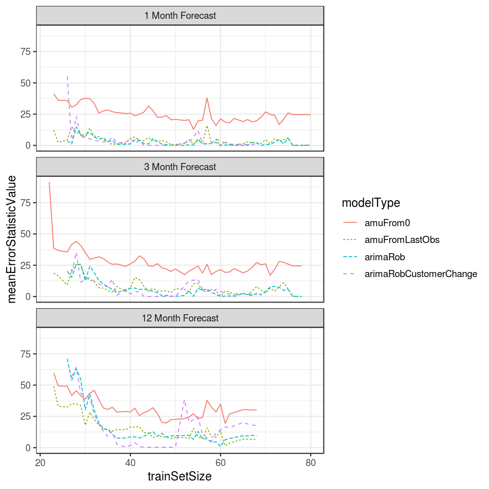

<link rel="stylesheet" href="styles.css" type="text/css">
<link rel="stylesheet" href="academicicons/css/academicicons.min.css"/>

  
  

## Data science for the Public Good

In Summer 2021 I had the honor of working with the Iowa Department of Human Rights (IDHR) as part of the [Data Science for the Public Good](https://dspg.iastate.edu/) program.
IDHR was interested in collecting and analyzing Iowa workforce and economic development data to develop educational resources for state legislators and other stakeholders.
As a Graduate Fellow, I along with ISU faculty [Chris Seeger](https://dspg.iastate.edu/people/christopher-seeger) and [Bailey Hanson](https://dspg.iastate.edu/people/bailey-hanson) supervised a team of three undergraduate students.

As the team supervisor, I worked closely with the undergraduate students to teach them how to use R and help them clarify the "story" of their data.
My goal was less to dictate what each student should be working on and more to support them in searching for data that they would be passionate about analyzing.
For example, I collaborated with and taught one of our undergraduate students how to create an interactive shiny application to explore language usage across Iowa.
I developed resources such as an R package called `dspgWork` to scrape, save, and load data in a coherent manner.
I also created a website and wrote a variety of articles (accessible here: [https://dspg2021.github.io/work/](https://dspg2021.github.io/work/)) demonstrating how to pull, analyze, and visualize data using my and other R packages.
Apart from this supervisorial support role, I also took the lead on analyzing and summarizing data related to Iowa unemployment rates (see [here](https://dspg2021.github.io/work/index.html#how-does-employment-and-unemployment-compare-across-age-sex-and-raceethnicity)).

Using software such as the [`tidycensus`](https://walker-data.com/tidycensus/) and [`tidyverse`](https://www.tidyverse.org/) R packages, we pulled and analyzed data from the [American Community Survey](https://www.census.gov/programs-surveys/acs), [Public-Use Microdata Survey](https://www.census.gov/programs-surveys/geography/guidance/geo-areas/pumas.html), and other sources. 
We created poster series entitled *"Just the Facts" on Workforce and Economic Development* with our most salient findings.
These have been used by DHR to educate legislators and other stakeholders on, for example, how the COVID-19 pandemic affected Iowa unemployment rates across age, sex, and race/ethnicity.
I created a website to hold these posters accessible here: [https://dspg2021.github.io/work/index.html](https://dspg2021.github.io/work/index.html).
One of our undergraduate students also created an interactive dashboard to show language usage across Iowa (not publicly available currently).

## John Deere Data Analytics Intern

  

In Summer 2019 I had the opportunity to work with the Aftermarket Analytics team at John Deere Headquarters in Moline, IL.
One of their major products was developing a statistical model to predict when machines would require maintenance.
Using this model, necessary maintenance could be recommended before the machine broke down.

One of my tasks for the summer was to explore and validate a model to predict machine hour usage - a major predictor in their maintenance predictor model.
Machine hour usage is simply the cumulative number of hours that a machine has been in-use since manufacturing.
To accomplish this, I used the [`forecast`](https://cran.r-project.org/web/packages/forecast/index.html) R package to fit various time series models.
To compare models, I also developed a validation procedure that utilized rolling-origin cross-validation.
Using training data, we predict one month, three months, and 12 months away from a particular time step and compare the observed and predicted values.

Another task was to assess the data quality of the recorded machine hour times.
At the time, the Aftermarket Analytics group was throwing away a lot of usage data they were seemingly mis-recorded.
I performed a variety of exploratory data analyses to determine the source of these data anomalies.
I discovered that machines that had changed owners frequently throughout their lifetime were more likely to have mis-recorded data.
Additionally, I identified specific John Deere certified dealers in South Africa that frequently mis-recorded data.
While I left before the problem was fully resolved, one of the other members of the Aftermarket Analytics team reported the issue to the data quality team.

A summary of my summer projects, in the form of a Databricks notebook, can be found here <a href='./files/joeZemmelsDB_NB2.html'>here</a>.
